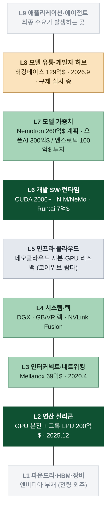
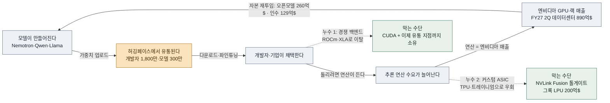

# 엔비디아는 왜 허깅페이스를 129억 달러에 인수했고 그 딜은 엔비디아의 다른 행보들과 어떻게 이어지는가

## 메모

엔비디아가 허깅페이스를 인수한 이유가 뭐야? 허깅페이스는 어떤 기업이고, 이 인수가 엔비디아의 다른 뉴스들과 어떻게 연관이 되는거지?

## 리서치

### 1. 허깅페이스는 어떤 회사이고, 엔비디아는 왜 ARR 1.5억 달러짜리 회사에 129억 달러를 냈나

#### 딜의 사실관계부터

CNBC가 협상을 먼저 보도한 것이 2026년 8월 27일이고[^cnbc-827], 엔비디아와 허깅페이스가 **확정 계약을 체결한 날짜는 2026년 9월 2일**, 공표는 9월 3일이다.[^8k][^bloomberg] 구조는 단순하다. **허깅페이스 주주에게 약 119억 달러**(조정 조건 부), **엔비디아에 합류하는 허깅페이스 임직원용 주식 기반 잔류 보상 최대 약 10억 달러**, 합계 **약 129.3억 달러**다.[^8k][^nv-blog] 클로징은 **2027년 상반기 예정**이며 통상적 선행조건과 **규제 승인**이 조건이다.[^8k] ⚠️ **대가의 지급 형태(현금·주식·혼합)는 8-K에 명시되지 않았다** — 총액만 공시됐다.[^8k]

주목할 만한 것은 엔비디아가 **8-K 리스크 문단에 "오픈소스 AI 모델에 대한 규제 가능성"을 이 인수의 효익을 훼손할 수 있는 요인으로 스스로 적어 넣었다**는 점이다.[^8k] 무엇을 산 것인지가 이 한 줄에 드러난다. 엔비디아는 칩이 아니라 **오픈모델 생태계 그 자체에 베팅**했다.

#### 허깅페이스: 청소년용 챗봇에서 "AI의 깃허브"로

2016년 뉴욕에서 프랑스인 3인(클레망 델랑그, 쥘리앵 쇼몽, 토마 울프)이 **청소년 대상 챗봇 앱** 회사로 창업했다. 사명은 🤗 이모지에서 왔다.[^wiki-hf][^turingpost] 2018년 구글이 BERT를 내놓자 팀은 일주일 만에 PyTorch 구현을 만들어 깃허브에 오픈소스로 풀었고, 이것이 **Transformers 라이브러리**가 됐다. 2019년 챗봇을 접고 오픈소스 ML 인프라로 정식 피벗했다.[^turingpost][^wiki-hf]

지금의 규모는 이렇다. 개발자·연구자 **1,800만 명 이상**, 공유된 모델 **300만 개 이상**, 데이터셋 **50만 개**, 애플리케이션 **100만 개**, 이용 기업 **20만 곳 이상**.[^nv-blog] 직원은 2026년 3월 기준 약 **750명**이다.[^mt]

수익 모델은 세 갈래다. ① Pro $9/월, 엔터프라이즈 $20/월/석의 **구독**, ② 모델 호스팅·추론(Inference Providers)·학습 클러스터 등 **사용량 기반 클라우드 매출과 클라우드 파트너 리퍼럴 수수료**, ③ 기업 맞춤 학습·배포 **계약 매출**. 최근 방향은 일회성 컨설팅에서 반복 매출로 옮겨가는 것이다.[^sacra]

ARR 궤적: 2023년 8월 3,000만 → 2024년 말 5,300만 → 2025년 말 8,100만 → 2026년 6월 1억 → **2026년 8월 1.5억 달러**.[^sacra] 인수 전까지 조달한 프라이머리 자금은 총 **3.96억 달러**이고 마지막 밸류에이션은 **2023년 45억 달러**였다. 즉 이번 딜은 **직전 밸류의 약 3배, ARR의 약 80배**다.[^sacra][^aitimes] 델랑그는 2026년 상반기 유료 구독이 두 배가 됐고 손익분기에 근접했다고 밝혔다.[^aitimes]

여기서 중요한 사실 하나: **엔비디아는 이미 허깅페이스의 기존 투자자였다.** 구글·아마존·인텔·IBM·세일즈포스와 함께 이름이 올라 있다.[^sacra]

#### 왜 샀나: 세 겹의 논리

**(1) 황 젠슨이 공개적으로 반복해온 인과. "오픈모델이 많이 쓰이면 엔비디아 컴퓨터가 더 팔린다."**

2026년 7월, 워싱턴이 딥시크·문샷 같은 중국 오픈모델을 경계할 때 황은 정반대로 말했다. "훌륭한 오픈소스 모델은 써야 한다", "훌륭한 AI가 있으면, 그것이 오픈이든 어디서 왔든, 사용이 늘어난다. 사용이 늘면 우리는 엔비디아 컴퓨터를 훨씬 더 많이 팔아야 하고 데이터센터를 더 지어야 한다."[^fortune-huang][^techspot] 중국이 미국의 AI 리더십을 밀어낼 가능성을 묻자 "제로"라고 답했다.[^fortune-huang] 이 논리에서 오픈모델은 경쟁자가 아니라 **수요 창출 장치**이고, 허깅페이스는 그 장치의 **유통 지점**이다.

**(2) 오픈웨이트의 무게중심이 중국으로 넘어갔다는 사실.**

허깅페이스가 2026년 8월 14일 낸 오픈모델 현황 보고서 기준, 2026년 허브 다운로드에서 알리바바 **Qwen이 약 20.45억 건**으로 구글 4.18억, 메타 2.27억을 압도했다.[^hf-report][^dealroom] Qwen 계열은 6개월 만에 누적 30억 다운로드를 넘겨 세계에서 가장 많이 내려받는 오픈웨이트 모델군이 됐고[^dealroom], 허깅페이스에 새로 만들어지는 LLM 파생모델의 **약 40%가 Qwen 기반**이다(라마는 약 15%).[^mit-tr] MIT 연구는 중국 오픈소스 모델이 총 다운로드에서 미국 모델을 추월했다고 정리한다.[^mit-tr]

엔비디아 입장에서 이것은 위협이 아니라 **길목**이다. 어느 나라 모델이 이기든 개발자는 허깅페이스에서 받는다. 칩 점유율 싸움이 격화될수록 "**개발자가 모델을 어디서 받고 무엇으로 돌리도록 기본 설정되는가**"가 더 중요해진다.

**(3) CUDA 옆에 두 번째 해자를 파는 작업의 연장.**

엔비디아는 2026년 3월, 향후 5년간 **오픈웨이트 모델 개발에 260억 달러**를 투입하겠다는 계획을 공시·확인했다.[^osfy-26b][^trendingtopics] 같은 달(3월 16일) **Nemotron Coalition**을 띄워 Black Forest Labs·Cursor·LangChain·Mistral AI·Perplexity·Reflection AI·Sarvam·Thinking Machines Lab과 오픈 프런티어 모델을 공동 개발하기로 했다.[^nemotron-pr] 황은 그 자리에서 "오픈모델은 혁신의 피이고 AI 혁명에 대한 글로벌 참여의 엔진"이라고 말했다.[^nemotron-pr]

즉 **모델을 만드는 쪽(Nemotron)은 이미 있었고, 이번에 산 것은 그 모델이 배포되는 쪽(유통망)이다.** 20년간 쌓은 CUDA가 첫 번째 해자라면, 오픈모델 생산과 유통을 함께 쥐는 것이 두 번째 해자다.

**(4) 매도 측 동기: 델랑그가 먼저 찾아왔다.**

엔비디아 블로그에 실린 황의 발언이 이 딜의 개시 경로를 보여준다. "클렘이 허깅페이스의 다음 장을 고민하면서 엔비디아가 이 회사와 커뮤니티, 그리고 오픈모델의 미래에 좋은 집이 되리라 믿고 나를 찾아온 것을 영광으로 생각한다."[^nv-blog] 엔비디아가 사냥한 것이 아니라 **허깅페이스가 매각 상대를 고른 구조**다.

#### ARR 80배는 무엇에 대한 값인가

재무가 아니라 **위치**에 붙은 값이다. 애널리스트들은 이를 방어적·헤지적 성격으로 읽는다. 오픈소스가 이기든 클로즈드 모델이 이기든 엔비디아가 성장할 수 있는 기반을 확보했다는 것이다.[^mt] 엔비디아가 공개한 인수 목적도 "플랫폼 신뢰성·안전성·모델 평가·추론·배포 역량 강화"로, **추론(inference) 파이프라인**이 명시적으로 들어 있다.[^nv-blog]

---

### 2. 이 인수는 엔비디아의 다른 뉴스들과 어떻게 한 줄로 꿰이는가: 칩 회사에서 AI 스택 지주회사로

#### 먼저 규모 감각: 129억은 엔비디아에게 큰돈이 아니다

FY2027 2분기(2026년 8월 26일 발표) 매출은 **962.2억 달러**(전년 대비 +106%), 데이터센터 매출 **890억 달러**(+117%, 전체의 약 92%), 비GAAP EPS 2.22달러로 컨센서스를 상회했다. 3분기 가이던스는 **1,080억 달러 ±2%**다.[^webull-q2][^investing-q2] 즉 **인수가 129억 달러는 한 분기 매출의 13% 남짓**이다. 그런데 이 가이던스에는 결정적 단서가 붙는다. **중국 데이터센터 컴퓨트 매출을 0으로 가정**한다.[^webull-q2]

#### 중국이라는 구멍이 전략을 밀어붙인다

엔비디아는 미국 정부로부터 중국 기업 약 10곳에 H200을 팔 수 있는 수출 허가를 받았지만 **실제로 거의 출하되지 않았고 중국 데이터센터 컴퓨트 매출은 발생하지 않았다**고 CFO 콜레트 크레스가 실적 콜에서 밝혔다.[^cnbc-china] H20 국면에서는 단일 분기 80억 달러 규모의 손실 처리가 있었고, 중국은 한때 데이터센터 매출의 5분의 1 이상을 차지했다.[^abhs-china] 블랙웰 기반 중국향 B30A가 논의됐지만 미결 상태다.[^ifp-b30a]

하드웨어 판매의 지리적 한 축이 막힌 상황에서, **중국 개발자들이 만든 오픈모델이 전 세계 GPU 수요를 늘리는 경로**는 엔비디아에게 남은 몇 안 되는 중국 익스포저다. 황이 중국 오픈모델을 옹호한 발언은 원칙론이 아니라 사업 논리에 가깝다.

#### 인접 딜들과의 공통 문법

최근 1년간 엔비디아의 행보는 세 축으로 정리된다.

**축 1: 경쟁 하드웨어의 우회로에 톨게이트를 세운다.**
- **그록(Groq) 약 200억 달러**(2025년 12월 24일 확정). 형식은 정식 인수가 아니라 **자산·기술 라이선스 + 핵심 인력 영입**이었고, 넥스트플랫폼은 엔비디아가 이 구조를 택한 이유를 "정식 인수는 1-2년이 걸리고 각국 반독점 당국을 통과하지 못할 수 있어서"라고 전한다.[^nextplatform-groq][^cnbc-groq] 창업자 조너선 로스(전 구글 TPU 설계자) 등 경영진이 엔비디아에 합류했고, 그록의 저지연 LPU를 **루빈 플랫폼의 디코드 최적화**에 통합하는 것이 목표다. 황은 저지연·프리미엄 토큰 생성이 AI 클러스터 연산의 약 25%를 차지할 것으로 봤다.[^nextplatform-groq]
- **미디어텍 전환사채 35억 달러**, 그 전 **마벨 20억 달러**: NVLink Fusion을 커스텀 ASIC 진영에 심는 구조. (기존 노트 [[엔비디아는 왜 미디어텍에 35억 달러를 투자했고 그 딜은 엔비디아의 비즈니스 모델을 어떻게 바꾸는가]] 참조)
- **인텔 50억 달러 투자**: 2025년 9월 발표, 미 반독점 당국 승인 완료.[^intel-clear]

**축 2: 수요 자체에 자금을 대준다.**
2025년 9월 오픈AI에 **최대 1,000억 달러** 투자 계획을 공개했으나 실제 집행은 **오픈AI 펀딩 라운드 300억 달러 + 앤스로픽 100억 달러**로 축소됐고, 황은 2026년 모건스탠리 TMT 콘퍼런스에서 **주요 AI 랩에 대한 직접 지분 투자는 사실상 끝**이라고 말했다.[^tradingkey][^tech-insider] 이 축은 "순환 금융(circular financing)" 논쟁을 낳은 영역이다.

**축 3: 소프트웨어·유통 레이어 (이번 딜).**
축 1이 "남의 칩이 지나가는 길에 요금소", 축 2가 "고객의 지갑을 채워 내 칩을 사게 하기"였다면, 허깅페이스는 **"모델이 세상에 배포되는 관문 자체를 소유하기"**다. 세 축 모두 같은 문제의 다른 해법이다: **GPU 판매만으로는 방어할 수 없는 지점을 인접 레이어로 막는다.**

#### 왜 지금인가: 위협의 형태가 바뀌었다

무게중심이 학습에서 **추론**으로 옮겨가고 있고, 추론은 하이퍼스케일러 자체 칩이 가장 강한 영역이다. 구글 TPU v7(Ironwood), 아마존 Trainium 3, 마이크로소프트 Maia 200, 메타 MTIA가 모두 추론 워크로드를 겨냥한다. 2026년 매출 기준 추정 점유율은 엔비디아 약 73%, 구글 TPU 약 8%, AMD 약 7%, AWS Trainium/Inferentia 약 5%, Maia+MTIA 합계 약 3% 수준이다.⚠️(민간 추정치, 기관마다 편차)[^alatirok][^introl] 구글은 외부 고객 데이터센터에 TPU를 직접 판매하기 시작했고 2026년 430만 대 출하를 전망한다.⚠️[^introl]

칩 성능 경쟁이 좁혀지는 국면에서 엔비디아가 지킬 수 있는 것은 **개발자의 기본 경로**다. 허깅페이스는 그 경로의 시작점이다. 그록(추론 하드웨어) + Nemotron(오픈모델 생산) + 허깅페이스(유통) 세 개를 나란히 놓으면 **추론 시대의 수직 통합**이라는 그림이 나온다.

#### 가장 큰 리스크: Arm의 재현

이 딜의 최대 변수는 시장이 아니라 규제다. 엔비디아는 2020년 **Arm을 400억 달러에 인수하려다 2022년 2월 포기**했다. FTC가 2021년 12월 소송을 냈고 영국 CMA·EU·중국의 압박이 겹쳤으며, 핵심 논거는 **"하드웨어의 스위스"인 Arm의 중립성 훼손**이었다.[^ftc-arm][^ftc-term]

허깅페이스에 대해 지금 나오는 우려는 그 논거의 복사판이다. 허깅페이스는 AMD·인텔·구글·아마존·중국 연구소가 모두 쓰는 **"AI 소프트웨어의 스위스"**이고, 지배적 GPU 벤더가 이를 소유하면 ① 검색 랭킹·기본 설정·모델 최적화가 엔비디아 쪽으로 기울고 ② AMD ROCm 같은 경쟁 백엔드가 후순위로 밀리며 ③ 경쟁사 프로젝트의 다운로드·사용 패턴이 엔비디아에게 보인다는 것이다.[^newstack][^yahoo-minefield]

엔비디아의 방어는 명시적이다. 플랫폼은 계속 개방하고, **"엔비디아 컴퓨트가 허깅페이스에서 빌드하거나 배포하는 데 필수가 되지 않으며"**, 멀티클라우드·멀티가속기 지원과 **타 실리콘 벤더 지원을 계속한다**고 블로그와 8-K에 함께 적었다.[^nv-blog][^8k] 황은 "허깅페이스는 AI 생태계 전체를 위한 개방 플랫폼으로 남는다"고 말했다.[^mt]

비판의 핵심은 그 약속의 **집행 가능성**이다. 개방 서약에 **기한도, 거버넌스 장치도, 독립 이사회도, 비엔비디아 백엔드에 대한 확약된 지출도 없다**는 지적이 나온다.[^newstack] 중립성은 명시적으로 철회될 필요가 없고 조용히 작동을 멈추면 된다는 것이다. 개발자 커뮤니티 일각에서는 신뢰가 무너지면 플랫폼을 포크하겠다는 논의도 나온다.[^yahoo-minefield]

여기서 그록 딜과의 대비가 의미를 갖는다. 그록에서는 반독점 심사를 피하려고 **자산·라이선스 구조**를 택했는데[^nextplatform-groq], 허깅페이스는 **정식 인수**다. 심사를 피할 수 없는 형태를 택했다는 것 자체가 엔비디아가 이 자산을 얼마나 원했는지를 보여주는 동시에, **2027년 상반기 클로징까지 규제 리스크가 실재**한다는 뜻이다.

---

### 3. 도식: AI 밸류체인에서 엔비디아는 원래 어디에 있었고 어디까지 뻗었나

한 문장으로 먼저 말하면, **엔비디아의 원래 자리는 붙어 있는 한 덩어리가 아니었다.** 맨 아래쪽의 **연산 실리콘(GPU)** 과 중간의 **개발 런타임(CUDA)**, 서로 떨어진 두 지점이었다. 이후의 모든 확장은 두 방향으로 진행됐다. 2020-2025년에는 **그 두 지점 사이를 메웠고**(네트워킹·랙·인프라), 2025-2026년에는 **위로 올라간다**(모델·유통). 허깅페이스는 그 위쪽 방향의 마지막 빈칸이다.

> 이 절의 두 도식을 크게 보려면: [엔비디아의 밸류체인 확장](https://claude.ai/code/artifact/98146ca1-14e5-4630-895d-188c09f2f999) (아티팩트)

#### 3-1. 밸류체인 9층과 엔비디아의 발자국

**색 읽는 법** : 진한 초록 = 원래 본진(L2 실리콘·L6 CUDA) / 연초록 = 인수·자체 구축으로 완료된 확장 / 주황 = 진행 중이며 규제 미완(허깅페이스) / 회색 = 자본으로만 참여(지분·리스백) / 흐린 회색 = 부재.

#### 3-2. 층별 대조표

| 층 | 하는 일 | 엔비디아의 자산·진입 | 시점·금액 | 그 층의 다른 플레이어 |
| --- | --- | --- | --- | --- |
| L9 애플리케이션 | 최종 사용처 | 없음 | - | 오픈AI·앤스로픽·수많은 앱 |
| **L8 모델 유통** | 개발자가 모델을 받는 관문 | **허깅페이스** | **2026.9 · 129.3억$** | (사실상 대체재 부재) |
| L7 모델 가중치 | 모델을 만든다 | Nemotron·Nemotron Coalition | 2026.3 · 260억$ 계획 | Qwen·딥시크·Llama / 오픈AI·앤스로픽(엔비디아 400억$ 투자) |
| **L6 개발 SW·런타임** | 칩을 쓰게 만드는 층 | **CUDA(본진)**·NIM·NeMo·Run:ai | 2006~ / Run:ai 7억$ | AMD ROCm·PyTorch·XLA |
| L5 인프라·클라우드 | 연산을 임대한다 | 네오클라우드 지분·리스백 | 2024-26 | AWS·Azure·GCP |
| L4 시스템·랙 | 칩을 묶어 판다 | DGX·랙·NVLink Fusion | 2016~ | 슈퍼마이크로·델 |
| L3 인터커넥트 | 칩끼리 잇는다 | Mellanox | 2020.4 · 69억$ | 아리스타·브로드컴 |
| **L2 연산 실리콘** | 연산한다 | **GPU(본진)**·그록 LPU | 1999~ / 그록 200억$ | 구글 TPU·트레이니엄·Maia·MTIA·AMD / 설계: 브로드컴·마벨(20억$)·미디어텍(35억$) |
| L1 파운드리·HBM | 만든다 | 없음(팹리스) | - | TSMC·ASML·SK하이닉스·삼성 |

Mellanox 69억 달러는 2019년 발표·**2020년 4월 완료**로 당시 엔비디아 사상 최대 인수였고(직전까지 최대가 4억 달러 미만), 지금의 데이터센터 네트워킹 사업의 뿌리다.[^mellanox] Run:ai는 GPU 워크로드 오케스트레이션 소프트웨어로 **7억 달러**에 인수됐는데, EU 집행위가 "엔비디아의 GPU 지배력(점유율 약 80%)을 강화하는가"를 들여다본 뒤 무조건 승인했다.[^runai] **L6에서 이미 한 번 겪은 심사를, 이번에는 L8에서 훨씬 큰 규모로 다시 겪는 셈이다.**

#### 3-3. 이 확장이 노리는 순환

층을 채우는 것 자체가 목적이 아니다. 황이 말한 인과가 하나의 닫힌 루프이고, 엔비디아는 그 루프에서 **돈이 새는 두 지점**을 막고 있다.

루프를 이렇게 읽으면 세 가지가 한꺼번에 설명된다. **첫째**, 왜 엔비디아가 중국 오픈모델을 옹호하는가: 루프의 입력(A)이 어디서 오든 출력(E)은 엔비디아 매출이기 때문이다. **둘째**, 왜 ARR 80배를 냈는가: B는 루프에서 유일하게 대체재가 없는 단일 통과 지점인데 엔비디아만 그 지점을 소유하지 않고 있었다. **셋째**, 왜 규제 리스크가 큰가: B가 단일 통과 지점이라는 사실이 곧 인수 동기이자 반독점 논거이기 때문이다. **엔비디아가 이 자산을 원하는 이유와 규제 당국이 막으려는 이유가 같은 문장이다.**

### 남은 미확인 지점

- **대가 지급 형태**(현금/주식/혼합): 8-K 미공시.[^8k] (확인 필요)
- **개방 서약의 계약적 구속력·기한**: 공개 문서에서 확인되지 않음. (확인 필요)
- 하이퍼스케일러 커스텀 실리콘 점유율·출하량 수치는 민간 리서치 추정치로 기관 간 편차가 크다.⚠️

---

[^8k]: SEC EDGAR, NVIDIA CORP Form 8-K (2026-09-02) — https://www.sec.gov/Archives/edgar/data/0001045810/000104581026000078/nvda-20260902.htm (검색일 2026-09-04)
[^nv-blog]: NVIDIA Blog, "NVIDIA to Acquire Hugging Face" — https://blogs.nvidia.com/blog/nvidia-to-acquire-hugging-face/ (검색일 2026-09-04)
[^bloomberg]: Bloomberg, "Nvidia to Buy Hugging Face for $13 Billion in Open-Source Push" (2026-09-03) — https://www.bloomberg.com/news/articles/2026-09-03/nvidia-agrees-to-13-billion-deal-for-ai-platform-hugging-face (검색일 2026-09-04)
[^cnbc-827]: CNBC, "Nvidia agrees to buy Hugging Face for $12.9 billion, report says" (2026-08-27) — https://www.cnbc.com/2026/08/27/nvidia-hugging-face-acquisition.html (검색일 2026-09-04)
[^mt]: 머니투데이, "엔비디아, 허깅페이스 인수…'어떤 AI 환경에서도 성장 가능 기반 마련'" (2026-09-04) — https://www.mt.co.kr/world/2026/09/04/2026090407433247588 (검색일 2026-09-04)
[^aitimes]: AI타임스, "엔비디아, '오픈소스' 허깅페이스 18조에 인수...AI 생태계 수직통합" — https://www.aitimes.com/news/articleView.html?idxno=214502 (검색일 2026-09-04)
[^sacra]: Sacra, "Hugging Face revenue, valuation & funding" — https://sacra.com/c/hugging-face/ (검색일 2026-09-04)
[^wiki-hf]: Wikipedia, "Hugging Face" — https://en.wikipedia.org/wiki/Hugging_Face (검색일 2026-09-04)
[^turingpost]: Turing Post, "Hugging Face: Founders, Funding, and Business Model" — https://www.turingpost.com/p/huggingfacechronicle (검색일 2026-09-04)
[^fortune-huang]: Fortune, "As Washington panics about Chinese AI, Jensen Huang says open-source models like Kimi are 'excellent' and should be embraced, not banned" (2026-07-22) — https://fortune.com/2026/07/22/jensen-huang-chinese-open-source-ai-models-kimi-deepseek-washington-ban-nvidia-chips-data-centers-security/ (검색일 2026-09-04)
[^techspot]: TechSpot, "Nvidia's Jensen Huang joins X, defends Chinese AI: 'Open-source models that are excellent should be used'" — https://www.techspot.com/news/113210-nvidia-jensen-huang-defends-chinese-ai-open-source.html (검색일 2026-09-04)
[^hf-report]: TheNextWeb, "Qwen is the world's most downloaded open model, by a smaller margin than Alibaba says" — https://thenextweb.com/news/alibaba-qwen-downloads-hugging-face-open-models (검색일 2026-09-04)
[^dealroom]: Dealroom, "Alibaba's Qwen hits 3B downloads, passing Meta and Google in open AI" — https://dealroom.co/news/145256-alibabas-qwen-hits-3b-downloads-passing-meta-and-google-in-open-ai/ (검색일 2026-09-04)
[^mit-tr]: MIT Technology Review, "What's next for Chinese open-source AI" (2026-02-12) — https://www.technologyreview.com/2026/02/12/1132811/whats-next-for-chinese-open-source-ai/ (검색일 2026-09-04)
[^osfy-26b]: Open Source For You, "Nvidia Targets Open AI Leadership With $26 Billion Model Development Plan" (2026-03) — https://www.opensourceforu.com/2026/03/nvidia-targets-open-ai-leadership-with-26-billion-model-development-plan/ (검색일 2026-09-04)
[^trendingtopics]: Trending Topics, "Nvidia Bets $26 Billion on Open-Source AI to Build a New Moat Next to CUDA" — https://www.trendingtopics.eu/nvidia-bets-26-billion-on-open-source-ai-to-build-a-new-moat-next-to-cuda/ (검색일 2026-09-04)
[^nemotron-pr]: NVIDIA Newsroom, "NVIDIA Launches Nemotron Coalition of Leading Global AI Labs to Advance Open Frontier Models" (2026-03-16) — https://nvidianews.nvidia.com/news/nvidia-launches-nemotron-coalition-of-leading-global-ai-labs-to-advance-open-frontier-models (검색일 2026-09-04)
[^webull-q2]: Webull, "Nvidia Q2 FY2027 Earnings: Beats Revenue & EPS Estimates, Guides Q3 to $108B" — https://www.webull.com/blog/304-Nvidia-Q2-FY2027-Earnings-Beats-Revenue-EPS-Estimates-Guides-Q3-to-108B (검색일 2026-09-04)
[^investing-q2]: Investing.com, "NVIDIA Q2 FY27 slides: revenue doubles to $96B, data center surges" — https://www.investing.com/news/company-news/nvidia-q2-fy27-slides-revenue-doubles-to-96b-data-center-surges-93CH-4878041 (검색일 2026-09-04)
[^cnbc-china]: CNBC, "Nvidia still hasn't sold its U.S.-approved China AI chips — and it's worried local AI rivals could take over" (2026-02-26) — https://www.cnbc.com/2026/02/26/nvidia-china-chip-sales-export-controls-ai-competition.html (검색일 2026-09-04)
[^abhs-china]: Abhishek Gautam, "Nvidia's $78B Guidance Hides an $8B China Hole" — https://www.abhs.in/blog/nvidia-78b-q1-fy2027-guidance-h20-china-ban-beijing-summit-variable-2026 (검색일 2026-09-04)
[^ifp-b30a]: Institute for Progress, "Should the US Sell Blackwell Chips to China?" — https://ifp.org/the-b30a-decision/ (검색일 2026-09-04)
[^nextplatform-groq]: The Next Platform, "Nvidia Finally Admits Why It Shelled Out $20 Billion For Groq" (2026-03-17) — https://www.nextplatform.com/ai/2026/03/17/nvidia-finally-admits-why-it-shelled-out-20-billion-for-groq/5209495 (검색일 2026-09-04)
[^cnbc-groq]: CNBC, "Nvidia buying AI chip startup Groq's assets for about $20 billion in its largest deal on record" (2025-12-24) — https://www.cnbc.com/2025/12/24/nvidia-buying-ai-chip-startup-groq-for-about-20-billion-biggest-deal.html (검색일 2026-09-04)
[^intel-clear]: Yahoo News, "Nvidia-Intel deal cleared by US antitrust agencies" — https://www.yahoo.com/news/articles/nvidia-intel-deal-cleared-us-170416932.html (검색일 2026-09-04)
[^tradingkey]: TradingKey, "From OpenAI to Hugging Face, Which AI Companies Has Nvidia Invested in in 2026?" — https://www.tradingkey.com/analysis/stocks/us-stocks/262135443-nvidia-2026-ai-investment-openai-huggingface-nvda-tradingkey (검색일 2026-09-04)
[^tech-insider]: Tech Insider, "Why Nvidia Dumped $40B in OpenAI & Anthropic [2026]" — https://tech-insider.org/nvidia-openai-anthropic-investment-pullback-2026/ (검색일 2026-09-04)
[^alatirok]: Alatirok, "AI Chip Market Share 2026: Nvidia, AMD, Custom Silicon" — https://alatirok.com/ai-chip-market-share-2026/ (검색일 2026-09-04)
[^introl]: Introl Blog, "Custom Silicon Inflection 2026: Hyperscaler ASICs vs NVIDIA GPU" — https://introl.com/blog/custom-silicon-inflection-2026-hyperscaler-asics-nvidia-gpu (검색일 2026-09-04)
[^ftc-arm]: FTC, "FTC Sues to Block $40 Billion Semiconductor Chip Merger" (2021-12-02) — https://www.ftc.gov/news-events/news/press-releases/2021/12/ftc-sues-block-40-billion-semiconductor-chip-merger (검색일 2026-09-04)
[^ftc-term]: FTC, "Statement Regarding Termination of Nvidia Corp.'s Attempted Acquisition of Arm Ltd." (2022-02) — https://www.ftc.gov/news-events/news/press-releases/2022/02/statement-regarding-termination-nvidia-corps-attempted-acquisition-arm-ltd (검색일 2026-09-04)
[^newstack]: The New Stack, "Nvidia's $12.9B Hugging Face deal has an open-source problem" (2026-08-27) — https://thenewstack.io/nvidia-hugging-face-acquisition-neutrality/ (검색일 2026-09-04)
[^yahoo-minefield]: Yahoo Finance, "Nvidia's Hugging Face Acquisition Is Logical, Ambitious, and Headed Straight Into a Minefield" — https://finance.yahoo.com/technology/ai/articles/nvidias-hugging-face-acquisition-logical-130000516.html (검색일 2026-09-04)

[^mellanox]: NVIDIA Newsroom, "NVIDIA Completes Acquisition of Mellanox, Creating Major Force Driving Next-Gen Data Centers" (2020-04) — https://nvidianews.nvidia.com/news/nvidia-completes-acquisition-of-mellanox-creating-major-force-driving-next-gen-data-centers (검색일 2026-09-04)
[^runai]: Calcalist (Ctech), "EU approves Nvidia's $700M acquisition of Israeli startup Run:ai" — https://www.calcalistech.com/ctechnews/article/wqwthsw2e (검색일 2026-09-04)

## 관련 노트

- [[엔비디아는 왜 미디어텍에 35억 달러를 투자했고 그 딜은 엔비디아의 비즈니스 모델을 어떻게 바꾸는가]] : 같은 전략의 하드웨어 쪽 절반이다. 커스텀 ASIC 우회로에 NVLink Fusion 톨게이트를 세우는 논리와, FY27 2분기 실적(962억·890억)이라는 동일한 배경을 공유한다. 이번 딜을 "소프트웨어 레이어 버전의 톨게이트"로 읽는 출발점.
- [[네오클라우드란 무엇이고 엔비디아는 왜 람다 같은 네오클라우드에 얽혀 있는가]] : 엔비디아가 투자자·고객·리스 보유자로 동시에 얽히는 방식을 보여준다. 축 2(수요에 자금을 대주는 구조)의 대표 사례이자, 허깅페이스 인수가 그 축과 어떻게 다른지 비교하는 대조군.
- [[프론티어 AI 랩과 벤더 파이낸싱은 무엇이고 브로드컴 실적에서 왜 등장했는가]] : 오픈AI·앤스로픽 투자가 왜 '순환 금융' 논쟁을 낳는지의 개념 정리. 이번 인수가 그 논쟁에서 상대적으로 자유로운 이유(현금흐름 있는 자산을 산 것)를 판단할 기준을 준다.
- [[cov-INTC-Intel]] : 엔비디아가 50억 달러를 투자한 대상이자, 허깅페이스의 기존 투자자이기도 하다. 중립성 우려의 당사자(경쟁 백엔드 보유자)와 엔비디아 투자 대상이 겹치는 구도를 볼 수 있다.
- [[cov-GOOG-Alphabet]] : TPU v7으로 추론 시장을 위협하는 최대 경쟁자이면서 허깅페이스의 기존 투자자다. "왜 지금 유통 레이어를 사야 했는가"의 압력이 어디서 오는지를 보여주는 축.
