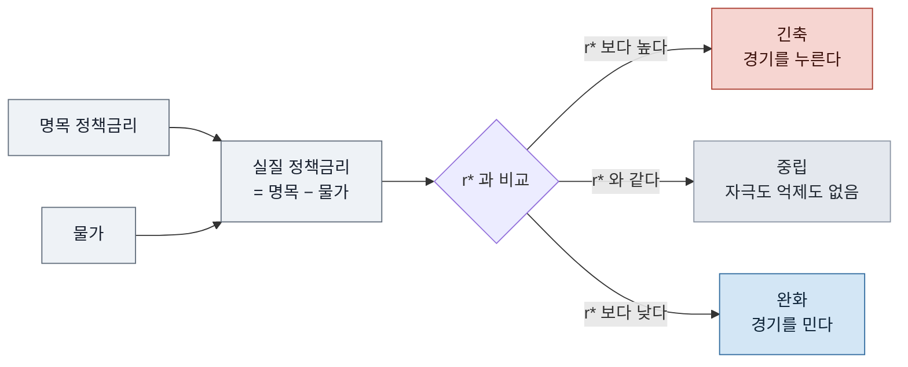
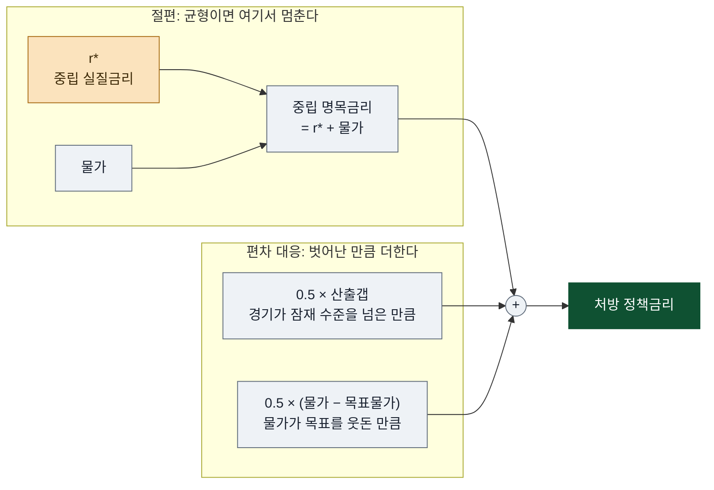

# 중립금리는 무엇이고 테일러 준칙은 그것을 어떻게 정책금리로 번역하나

_[[10년물 국채금리 5%는 왜 기준선이고 장기금리가 올랐는데 연준은 왜 인상하려 하나]]의 대주제 3을 독립시킨 파생 노트다. 사람이 쓴 메모에서 갈라져 나온 것이 아니므로 `## 메모` 절을 두지 않고, 개념 정리를 `## 리서치` 첫 블록에 둔다._

## 리서치

### 개념 - 중립금리와 테일러 준칙

이 노트를 읽기 전에 두 용어를 먼저 정리한다. 아래 본문은 이 둘이 2026년에 어떻게 움직였는지를 다룬다.

**중립금리(r\*)** 는 **경기를 자극하지도 억제하지도 않는 실질 단기금리**다. 뉴욕 연은의 정의로는 경제가 완전히 가동되고 물가가 안정됐을 때 성립할 것으로 예상되는 실질 단기금리, **경제가 잠재산출(완전고용)에 있을 때** 저축과 투자를 일치시키는 실질금리다[^nyfed]. 

- **실질 개념이다.** 명목금리에서 물가를 뺀 값을 기준으로 삼는다. 그래서 정책 판정도 `실질 정책금리 = 명목 정책금리 - 물가`를 r\*과 비교해서 한다.
	- 피셔 방정식(i = r + π)에서 실질금리를 유도할 수 있다. 실질금리는 돈을 빌리고 빌려줄 때 실제로 오가는 구매력의 대가.
	- 금리 종류마다 실질금리가 따로 있다. 정책금리에서 물가를 빼면 실질 정책금리, 10년물에서 빼면 10년 실질금리(TIPS 금리).	
	- r\*은 "경제가 완전고용 상태이고 물가가 안정적일 때 성립하는 실질 단기금리"이다. 즉, 실질금리가 도달할 수 있는 값 가운데 균형에 해당하는 값.
- **판정 기준이지 목표가 아니다.** 실질 정책금리가 r\* 위면 긴축, 아래면 완화다. 연준이 r\*을 맞추려 드는 것이 아니라, 지금 정책이 긴축인지 완화인지를 재는 자리가 r\*이다.
- **저축과 투자의 균형이 결정한다.** 돈을 빌려 쓰겠다는 수요가 늘거나 대겠다는 공급이 줄면 둘을 맞추는 실질금리가 올라간다. 지난 25년간 선진국 r\*이 내려온 원인으로 인구구조·추세 생산성 둔화·글로벌 요인이 꼽혀온 것도 같은 틀이다[^nyfed].
- **관측되지 않는다.** 시장에 호가가 없고 모형으로만 추정되며, 모형끼리 값이 어긋난다[^rstar][^pimco]. 



**테일러 준칙**은 **r\*을 정책금리 처방으로 번역하는 식**이다. 가장 널리 알려진 형태는 다음과 같다[^crs].

```
정책금리 = (r* + 물가) + 0.5 × 산출갭 + 0.5 × (물가 - 목표물가)
```

- 첫 괄호가 **중립 명목금리**다. r\*에 물가를 더해 명목으로 환산한 값이고, 경제가 딱 균형이면 여기서 멈춘다.
- 뒤의 두 항이 **편차에 대한 대응**이다. 경기가 잠재 수준을 넘거나 물가가 목표를 웃돌면 그만큼 더 올리라고 처방한다.
- **r\*은 이 식의 절편이다.** 물가도 산출갭도 그대로여도 r\*이 1%p 오르면 처방 금리가 그대로 1%p 오른다. 아래 (6)이 이 점을 다룬다.
- 테일러는 원래 r\*을 2%로 고정해 썼지만[^crs], 애틀랜타 연은 계산기는 그 자리에 LW·HLW·Lubik-Matthes 같은 모형 추정치를 갈아끼울 수 있게 해두었다. 어떤 r\*을 넣느냐로 처방이 크게 달라지기 때문이다[^atlfed].

r\*이 오르면 같은 정책금리가 덜 긴축적이라는 판정을 받고, 준칙은 그 판정을 "몇 bp 더 올려야 한다"는 숫자로 바꿔준다. 그래서 **r\*이 오르는 국면에서 동결은 중립이 아니라 완화가 된다**(아래 (7)).


### r\*은 왜 오르고 있고, 준칙은 그것을 어떻게 정책금리로 번역하는가

**(1) 10년 실질금리는 사실상 "앞으로 10년간의 실질 정책금리 예상 평균"이다.** 

장기금리 = 기대경로 + 텀프리미엄이라는 분해[^tantrum]를 실질 버전으로 옮기면, 10년 TIPS 금리는 시장이 예상하는 향후 실질 단기금리들의 평균에 실질 텀프리미엄을 더한 값이다. 그러니 텀프리미엄이 그대로인데 10년 실질금리만 올랐다면, **시장이 "미국의 실질 정책금리는 예전 생각보다 높은 자리에 머물 것"으로 전망을 고쳐 잡았다**는 뜻이 된다. 그 "머물 자리"의 이름이 중립금리다.

**(2) 중립금리는 어디에 있나.** 

중립금리의 수준을 결정하는 것은 **잠재산출 상태에서의 저축과 투자의 균형**이다. 경제가 완전고용일 때 자금을 쓰겠다는 수요가 늘거나 대겠다는 공급이 줄면, 둘을 맞추는 실질금리가 올라간다. 실제 실질금리는 단기적으로 연준이 정하므로 이 값과 어긋날 수 있고, 그 어긋남이 정책 기조다. 
지난 25년간 선진국 중립금리는 인구구조, 추세 생산성 둔화 등의 요인으로 하락해왔는데, 최근 1년 뉴욕 연은 Laubach-Williams 모형 추정치는 2025년 1분기 1.36% → 2026년 1분기 1.73% → 2026년 2분기 1.65%로 상승 추세를 보이고 있다.

**(3) AI 자본지출이 올리는 경로 - 투자 수요의 급증.** 

저축-투자 틀에서 보면 AI 데이터센터 건설은 **투자 수요 곡선을 통째로 오른쪽으로 미는 사건**이다. 자금을 빌려 쓰겠다는 사람이 갑자기 늘었으니 같은 저축 풀을 두고 경쟁이 붙고, 균형 실질금리가 올라간다. 하이퍼스케일러 채권 발행은 2020-2024년 연평균 약 350억 달러에서 2025년 930억 달러, 2026년 연초 이후 약 1,320억 달러로 뛰었고, 미국 투자등급 회사채 전체 발행은 사상 처음 2조 달러를 넘길 궤도다[^fortune]. "역구축효과"는 이 현상을 채권시장 가격 형성의 언어로 본 것이고, 중립금리는 같은 현상을 자본의 수급 균형이라는 언어로 본 것이다.

여기에 생산성 경로가 더해진다. **AI가 실제로 생산성을 끌어올리면 자본의 기대수익률이 올라가고, 기대수익률이 높아지면 사람들이 소비를 미룰 유인이 줄어(저축 유인 감소) 중립금리가 올라간다.** 1990년대 후반 IT 붐 때 생산성 상승과 중립금리 추정치 상승이 같이 나타난 것이 이 경로의 선례로 인용된다[^pimco]. 트루이스트의 칩 휴이는 "AI 구축을 둘러싼 투자 증가와 정부 부채 증가가 자본 수요를 끌어올려 실질금리를 밀어올린다"고, 크레딧사이츠의 재커리 그리피스는 "더 높아진 r\*이 커브 전 구간의 금리를 밀어올리고 있다"고 말한다[^rstar].

**(4) 정부 차입이 올리는 경로 - 저축 풀의 잠식.** 

정부가 적자를 내면 그만큼 국민저축이 줄어든다. 투자 수요는 그대로인데 자금 공급이 줄면 역시 균형 실질금리가 올라간다. 미국 부채는 40조 달러, 회계연도 적자 2조 달러, 연간 이자비용 1조 달러다[^fortune].

- 댈러스 연은(2025): 부채/GDP 비율 1%p 상승당 장기금리 약 **3bp** 상승[^dallasdebt]
- CBO: 같은 기준 **2bp**를 가정[^dallasdebt]
- 라우바흐(2009): 예상 부채비율 1%p당 3-4bp, 추세성장 변수를 통제하면 2.2bp[^mercatus]

댈러스 연은은 그 3bp 중 약 4분의 3이 기대 단기금리가 아니라 텀프리미엄 경로로 들어온다고 추정한다. **재정 뉴스에 채권시장이 텀프리미엄을 먼저, 그리고 과하게 조정**한다는 것이다[^dallasdebt]. 그렇다면 **정부 차입발 금리 상승은 엄밀히는 r\* 상승이 아니라 텀프리미엄 상승에 해당**한다. 

즉 AI 투자발 상승과 재정발 상승은 겉보기에 똑같이 "실질금리 상승"으로 나타나지만 정책 함의가 반대다. 

**(5) 반론 - AI가 중립금리를 오히려 낮출 수도 있다.** 

핌코는 2026년 7월 1일 이 통념을 정면으로 반박했다. 2023년 1월 이후 주요 AI 모델 공개 43건을 추려 그날들의 수익률 변화만 누적했더니 **약 100bp 하락**이었다. 같은 기간 전체 금리는 100bp 올랐으므로, AI 발표일을 빼면 금리는 200bp 올랐어야 한다는 계산이다. 핌코가 제시한 이유는 두 가지다. 

첫째 **예비적 저축** - 1990년대와 달리 지금의 AI 이익은 자본 보유자에게 좁게 몰리고, 일자리 대체를 걱정하는 노동자는 저축을 늘려 안전자산 수요를 키운다. 
둘째 **재정 경로** - 생산성이 올라가면 재정 지속가능성 전망이 개선되어 텀프리미엄이 눌린다. 핌코의 결론은 "AI는 중기적으로 채권에 강세 요인일 수 있다"이다[^pimco].

실제로 LW 추정치도 2026년 2분기에는 1.73%에서 1.65%로 내려왔다[^rstar]. 로이터도 이 투자 급증이 구조적 변화인지 또 한 번의 사이클인지는 수년치 데이터가 쌓여야 알 수 있다고 적었다[^rstar].  정리하면, **r\*이 오르고 있다는 것은 현재 시장과 다수 애널리스트의 해석이지 확립된 사실이 아니다.**

**(6) 테일러 준칙 - r\*을 정책금리로 번역하는 장치.** 

가장 널리 알려진 형태는 `정책금리 = (r\* + 물가) + 0.5 × 산출갭 + 0.5 × (물가 - 목표물가)`이고, 테일러는 원래 r\*을 2%로 고정해 썼다[^crs]. 애틀랜타 연은의 계산기는 이 r\* 자리에 LW·HLW·Lubik-Matthes 같은 모형 추정치를 갈아끼울 수 있게 해두었는데, 어떤 r\*을 넣느냐에 따라 처방이 크게 달라지기 때문이다[^atlfed]. 핵심은 **r\*이 식의 절편**이라는 점이다. 물가도 그대로, 산출갭도 그대로여도 **r\*이 1%p 오르면 준칙이 처방하는 정책금리도 그대로 1%p 오른다.** 어윈이 7월 회견에서 "연방기금금리가 테일러 준칙 추정치보다 약 100bp 낮다"고 한 계산의 상당 부분이 여기서 나온다[^presconf].

**(7) 직관으로 옮기면.** 강을 거슬러 노를 젓는다고 하자. 정책금리는 내가 젓는 속도, 중립금리는 물살의 속도다. 물살이 빨라졌는데 젓는 속도를 그대로 두면 아무것도 바꾸지 않았는데 배는 뒤로 밀린다. **중립금리가 오르는 국면에서 "동결"은 중립이 아니라 완화다.** 연준이 가만히 있는 동안 정책의 긴축 강도가 저절로 빠져나가고, 물가가 목표를 웃도는 중에는 그 자체가 인상의 근거가 된다.

숫자로 대보면 이렇다. 정책금리 중간값 3.625%에서 8월 근원 CPI 2.4%를 빼면 실질 정책금리는 약 1.2%p로, LW 중립금리 추정치 1.65%보다 낮다. 연준이 실제로 보는 근원 PCE 기준(7월 의사록의 staff 추정, 5월 3.4%)으로 계산하면 실질 정책금리는 아예 0 부근이다. 어느 기준으로 보든 **지금 정책은 긴축이 아니다**라는 것이 인상론의 산술적 뼈대다. (이 뺄셈은 출처의 서술이 아니라 노트 작성자의 계산이다.)

**(8) 그래도 준칙은 결정 규칙이 아니라 눈금자다.** 세 군데가 흐릿하기 때문이다.

- ⚠️ 10년 TIPS 금리 2.60%는 r\*이 **아니다.** 기대 실질금리 평균에 실질 텀프리미엄이 섞인 값이라, 이 숫자를 곧 중립금리로 읽으면 과대추정이 된다.
- ⚠️ "텀프리미엄은 그대로였다"는 판정 자체가 모형 의존적이다[^tantrum]. (4)에서 본 대로 재정발 상승분의 4분의 3이 텀프리미엄이라면 갈림길의 방향이 바뀐다.
- ⚠️ r\*은 관측되지 않고 모형으로만 추정되며, 추정치끼리도 어긋난다[^rstar][^pimco].

그래서 준칙은 "왜 지금 정책금리가 낮아 보이는가"를 설명해주는 눈금자이지 버튼이 아니다. 워시가 시장금리를 "받아쓰기(dictation)로 받지는 않는다"고 말한 것이 이 뜻이다[^presconf]. 연준을 실제로 움직이는 것은 준칙 계산이 아니라 원 노트 대주제 2에서 본 두 가지 - 시장이 이미 매긴 가격(2년물 4.37%)과 기대 고정 문제 - 다.

## 관련 노트

- [[10년물 국채금리 5%는 왜 기준선이고 장기금리가 올랐는데 연준은 왜 인상하려 하나]] - 이 노트가 갈라져 나온 원 노트. 10년물 5%가 왜 기준선인지, 장기금리가 이미 올랐는데도 왜 인상 논의가 나오는지를 다룬다. 이 노트의 (1)이 잇는 "남긴 고리"가 그 노트 대주제 2의 끝이다.
- [[성장은 왜 물가를 올릴 수밖에 없는가]] - 실질금리·피셔 방정식(i = r + π)의 기본 골격을 정리한 노트. 이 노트가 실질과 명목을 오갈 때 전제로 깔린 관계다.
- [[골디락스 존은 무슨 뜻이고 최근 경제뉴스에서는 어떤 맥락으로 쓰였나]] - 성장과 물가가 동시에 적당한 좁은 구간을 가리키는 말. 준칙의 두 편차 항이 모두 0에 가까운 상태가 그 구간에 해당한다.
- [[10년물 하나에 손잡이가 일곱 개 있다, 누가 무엇을 쥐고 있고 우리는 어디를 못 보고 있나]] - 이 노트의 r\*과 준칙을 "손잡이가 아니라 눈금자"로 배치한 wiki 노트. 정책금리·대차대조표·발행구조 같은 손잡이들과 이 눈금자의 관계를 본다.

---

[^tantrum]: 연방준비제도 FEDS Notes, "The Treasury Tantrum of 2023" (2024-09-03) - https://www.federalreserve.gov/econres/notes/feds-notes/the-treasury-tantrum-of-2023-20240903.html (2026-09-15 검색)
[^nyfed]: 뉴욕 연은, "Measuring the Natural Rate of Interest" (2026-08-27 갱신) - https://www.newyorkfed.org/research/policy/rstar (2026-09-15 검색)
[^rstar]: Reuters(Kitco 전재), "Analysis-Bond selloff is likely amplified by obscure economic rate" (2026-09-03) - https://www.kitco.com/news/off-the-wire/2026-09-03/bond-selloff-likely-amplified-obscure-economic-rate (2026-09-15 검색)
[^fortune]: Fortune, "AI hyperscalers issuing a flood of bonds are 'reverse crowding out' the Treasury as US debt soars" (2026-08-29) - https://fortune.com/2026/08/29/us-debt-reverse-crowding-out-effect-ai-hyperscaler-bonds-treasury-yields/ (2026-09-15 검색)
[^pimco]: PIMCO, "Macro Signposts: Does AI Raise or Lower Neutral Rates?" (2026-07-01) - https://www.pimco.com/us/en/insights/does-ai-raise-or-lower-neutral-rates (2026-09-15 검색)
[^dallasdebt]: 댈러스 연은, "How sensitive are interest rates to higher federal debt?" (2025-08-12) - https://www.dallasfed.org/research/economics/2025/0812 (2026-09-15 검색)
[^mercatus]: Mercatus Center, "The Impact of Public Debt on Interest Rates" - https://www.mercatus.org/research/policy-briefs/impact-public-debt-interest-rates (2026-09-15 검색, 본문 미열람 - 라우바흐(2009) 추정치의 2차 인용)
[^crs]: 미 의회조사국(CRS), "Monetary Policy and the Taylor Rule" (IF10207) - https://www.congress.gov/crs-product/IF10207 (2026-09-15 검색, 본문 403으로 미열람 - 검색 결과가 인용한 식 표기)
[^atlfed]: 애틀랜타 연은, "Taylor Rule Utility" - https://www.atlantafed.org/research-and-data/data/taylor-rule (2026-09-15 검색)
[^presconf]: 연방준비제도, "Transcript of Chairman Warsh's Press Conference, July 29, 2026" - https://www.federalreserve.gov/mediacenter/files/FOMCpresconf20260729.pdf (2026-09-15 검색)
