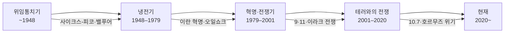

# 중동 분쟁의 역사

## Layer 1 — 갈등 축 (Conflict Axis)

- [[이스라엘-팔레스타인]] — 1917 벨푸어 선언 → 나크바 → 6일전쟁 → 오슬로 → 10.7
- [[이스라엘-이란]] — 1979 혁명 이후 반이스라엘 노선 → 핵 프로그램 → 2025 공습
- [[미국-이란]] — 1953 쿠데타 → 혁명 → 핵합의 → 솔레이마니 → 2026 본토 공습
- [[사우디아라비아-이란]] — 수니-시아 지역 패권 다툼, 예멘·시리아·이라크 대리전의 배경 축 🔶
- [[이스라엘-아랍]] — 캠프 데이비드(1978) → 아브라함 협정(2020) → 사우디 정상화 논의 🔶

## Layer 2 — 행위자 (Actor)

### 비국가 행위자

- [[하마스 (Hamas)]] — 무슬림형제단 계열, 가자 통치 세력
- [[헤즈볼라 (Hezbollah)]] — 이란 IRGC가 창설·지원, 레바논 내 준국가 조직
- [[후티 반군 (Houthis)]] — 자이디 시아파, 이란 저항의 축 말단
- [[저항의 축 (Axis of Resistance)]] — 이란-헤즈볼라-하마스-후티를 묶는 프록시 네트워크
- ISIS & 알카에다 — 수니 극단주의 계보, 하마스·후티와의 차이를 비교 이해하는 데 필요

### 국가 행위자 내 핵심 기관

- [[이란 혁명수비대 (IRGC)]] — 이란 외교정책의 실질적 실행자, 저항의 축 총괄

### 지역

- [[가자 지구 (Gaza strip)]] — 봉쇄·인도적 위기·하마스 통치의 현장

## Layer 3 — 구조 (Structure)

### 종파·이념

- [[유대교와 이슬람교 (Judaism & Islam)]]
- [[수니파와 시아파 (Sunni & Shia)]] — 이슬람 내부의 분열. 중동 거의 모든 대립의 이념적 기저
- 와하비즘 / 살라피즘 — 사우디 건국 이념, 수니 극단주의의 사상적 뿌리 🔶
- 아랍 민족주의 (나세르주의) — 이슬람주의 이전 세대의 저항 이데올로기 ⬜

### 에너지 지정학

- [[페트로달러 (Petrodollar)]]
- [[셰일혁명 (Shale Revolution)]]
- [[오일쇼크 (Oil Shock)]]

### 지정학적 요충지

- [[호르무즈 해협 (Strait of Hormuz)]] — 세계 원유 20% 통과, 이란의 최후 카드
- [[수에즈 운하 (Suez Canal)]] — 1956 위기의 현장, 호르무즈와 쌍으로 이해

### 국제 프레임

- 이스라엘 핵 모호성 정책 — 이란 핵 문제를 이해하기 위한 대칭 구조 🔶
- UN 안보리와 중동 분쟁 — 왜 국제법으로 해결이 안 되는가 ⬜

---

## 시대별 흐름 요약

